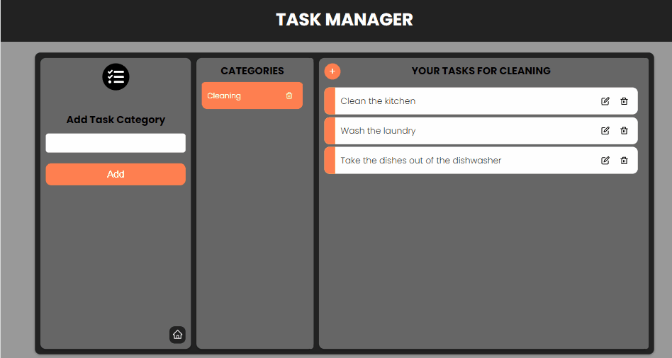

## Task Manager Frontend

A task manager application built with React JS for the frontend and Express JS and Mongoose for the backend.

## Features

### Sign In & Sign Out

The user must log in to use task manager .

### Usage of the Task Manager

After logging in, the user can add task categories and tasks for these categories, update the status of these tasks, or delete tasks.


## Built With

- React JS
- CSS Modules

## Getting Started

### Prerequisites

Install npm.

- npm
  ```
  npm install npm@latest -g
  ```

### Installation

1. Clone the repo.
   ```
   git clone https://github.com/Tanju67/Task-Manager.git
   ```
2. navigate into the frontend directory.
   ```
   cd .\frontend\
   ```
3. Install NPM packages.
   ```
   npm install
   ```
4. Create the backend url in a .env file.
   ```
   REACT_APP_BASE_URL=http://localhost:5000/
   ```
5. Start the frontend server (Firstly you must start backend server).
   ```
   npm start
   ```

# Task-Manger-Backend

**Task-Manager** is one of my personal projects.This repository holds the code of it's backend which is a **RESTful API**.

### Contents

- [Task-Manger-Backend](#task-manger-backend)
  - [Contents](#contents)
  - [Features:](#features-1)
  - [Tech used:](#tech-used)
  - [How to get the project:](#how-to-get-the-project)
  - [API endpoints:](#api-endpoints)
    - [_Indication_](#indication)
    - [Auth related](#auth-related)
    - [Category related](#category-related)
    - [Task related](#task-related)

## Features:

- Users can register their profiles (token-based authentication)
- Users can create and delete task categories.
- Users can create tasks for these categories.
- Users can update tasks.
- Users can delete tasks.

## Tech used:

**Runtime environment**

- [x] Node.js

**Database**

- [x] MongoDB

## How to get the project:

1. Navigate into backend directory.

```
  cd .\backend\
```

2. Create the backend url in a .env file.

```
MONGO_URI=(your mongo uri)
JWT_SECRET= (create your key)
JWT_LIFETIME=(create your key)
PORT=5000
```

3.  Install NPM packages.

```
npm install
```

4.  Start the server .

```
npm start
```

## API endpoints:

#### _Indication_

- [x] **Authentication required**
- [ ] **Authentication not required**

### Auth related

- [ ] Resgister: `POST localhost:5000/api/v1/auth/register`
- [ ] Login: `POST localhost:5000/api/v1/auth/login`
- [ ] Logout: `GET localhost:5000/api/v1/auth/logout`
- [ ] Refetch: `GET localhost:5000/api/v1/auth/refetch`

### Category related

- [x] Get all categories: `GET localhost:5000/api/v1/category`
- [x] Create category: `POST localhost:5000/api/v1/category`
- [x] Delete category: `DELETE localhost:5000/api/v1/category/:cId`

### Task related

- [x] Get all tasks: `GET localhost:5000/api/v1/task/:cId`
- [x] Create task: `POST localhost:5000/api/v1/task/:cId`
- [x] Update Task: `PATCH localhost:5000/api/v1/task/:tId`
- [x] Delete Task: `DELETE localhost:5000/api/v1/task/:tId`
